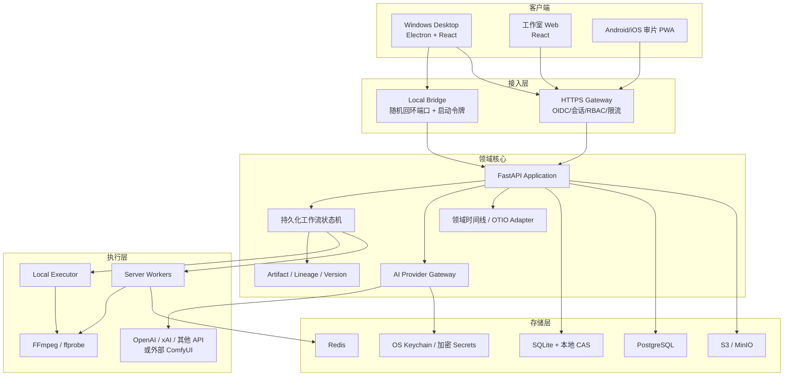

# 系统架构与部署

## 架构决定

采用 Web 技术优先的模块化单体：React/TypeScript 负责创作界面，FastAPI/Python 负责领域逻辑与 AI/媒体编排，Electron 提供 Windows 桌面壳。服务器版复用同一 API 和前端构建，通过替换存储、身份和执行器实现多人协作。

不以 Qt 或原生 Android 作为首版主界面。Qt 的本地媒体性能优秀，但会显著提高无限画布、协作、后台管理和移动审片的重复开发成本；Android 全功能剪辑也不是小屏的正确入口。性能热点在测量后再以 Rust/C++ 媒体模块补强，不提前重写整套 UI。

## 逻辑分层



## 三种运行形态

### 1. 个人桌面模式

- Electron 启动 Python sidecar，由操作系统选择空闲 `127.0.0.1` 端口。
- 主进程通过匿名管道读取端口和一次性启动令牌；端口、令牌和系统密钥永不传给 Renderer。
- Renderer 运行在 `app://aijian` 安全自定义 Scheme，通过 preload 暴露的类型化 `api.invoke` 调用；Electron main 使用 OpenAPI 生成的 IPC transport 代发 HTTP。Web 构建则换用 HTTPS transport。
- API 只接受回环地址、Electron main 的本次会话令牌、固定 Host 和 Origin；不启用宽松 CORS。
- SQLite 开启 WAL；素材按 SHA-256 存在项目库，数据库只存元数据和引用。
- 长任务由本地任务表和子进程执行器恢复；关闭窗口进入托盘，main/sidecar/worker 继续。选择“退出应用”时停止领取新任务、等待安全检查点后结束本地子进程；已提交的远程任务不自动取消，下次启动继续轮询。异常退出由租约恢复，禁止留下不可管理的孤儿进程。
- 所有外部模型请求仍走 Provider Gateway，密钥存 Windows Credential Manager。

这解决个人创作者的安装和离线编辑问题。其他电脑不能访问这个随机端口，也不应该访问。

### 2. 工作室服务器模式

- API/Worker 以容器或安装包部署在局域网服务器/云服务器。
- 对外只开放 Caddy/Nginx 的 `443`；API 和队列端口在私网。
- OIDC/Passkey/密码登录任选其一，所有资源带 `workspace_id`，RBAC 至少包含 Owner、Producer、Creator、Reviewer、Guest。
- PostgreSQL 保存业务与任务真相；S3/MinIO 保存素材；Redis 只做排队、缓存和通知，不是唯一状态源。
- 桌面端可填写 `https://studio.example.com` 切换到团队工作区，Web/PWA 使用同一域名。
- 审批、评论和版本事件通过 WebSocket/SSE 推送；关键写操作仍以 HTTP 事务落库。

### 3. 手机审片 PWA

首版不做完整 Android 剪辑器，只覆盖适合小屏的高价值场景：

- 登录工作区、查看剧集/镜头/版本。
- 逐帧或时间码批注、圈画、语音意见。
- 通过/驳回 Gate，指派修改人。
- 查看任务队列、费用和失败原因；允许取消尚未发出的任务。
- 拍摄/上传参考图和环境音。

PWA 可安装到 Android/iOS 桌面。离线只允许查看缓存、草拟普通批注和播放低码率代理；Gate 审批、任务取消、预算和成员操作必须在线，并携带确切 `version_id + If-Match`。重连时如果版本已变化，批注进入冲突队列，不能自动贴到新版本。不在手机端保存供应商 API Key。

## 模块边界

建议仓库结构：

```text
apps/
  desktop/           Electron 主进程、安装更新、sidecar 生命周期
  studio-web/        React 创作端与 PWA 审片端
services/
  api/               FastAPI 组合根、REST/WebSocket
  worker/            本地和服务器任务执行入口
packages/
  contracts/         OpenAPI 生成客户端、JSON Schema、事件定义
  domain/            项目/故事/镜头/资产/审批/时间线规则
  workflow/          图定义、状态机、依赖失效、检查点
  providers/         文本/图像/视频/语音/音乐/口型能力接口
  media/             FFmpeg 探测、代理、合成、导出
  ui/                设计系统和可复用组件
infra/
  compose/           本地工作室服务器联调
  migrations/        PostgreSQL/SQLite 迁移策略
docs/
tests/
```

Python 与 TypeScript 无法共享运行时代码，因此跨边界的真相只有 OpenAPI/JSON Schema。领域规则必须有后端实现；前端验证只改善体验，不能成为权限或一致性的唯一防线。

## 核心数据模型

```text
Workspace -> Project -> SourceDocument -> SourceBlock
Project -> StoryBible -> Character/Location/Prop/Costume/Relationship
Project -> Season -> Episode -> Scene -> Shot
Shot -> ShotIntent -> PromptPlan -> GenerationAttempt -> AssetVersion
Episode -> Track -> Clip -> TimelineVersion -> Export
ArtifactVersion -> SourceSpan[] / DependencyEdge[] / Approval[]
WorkflowRun -> NodeRun -> Attempt -> CostRecord / Log / Checkpoint
```

所有可生成对象都使用 Artifact Envelope：`id` 永久稳定，`version_id` 不可变；修改会创建新版本，并通过 DependencyEdge 计算下游失效范围。

`SourceSpan` 固定引用 `source_document_version_id + source_block_version_id`，范围使用规范化 UTF-8 的左闭右开字节偏移并附引用文本哈希；原文件页码/段落和 raw-to-normalized 映射另存。JavaScript/Python 都不得使用各自字符串索引充当跨边界坐标。

时间线 API 禁止浮点秒，统一使用约分有理数 `{num, den}`。项目帧率、源媒体 timebase、源入出点、时间线位置和代理映射分别保存；具体规则见 ADR-0003。

## API 设计

API 使用 `/api/v1`，资源命名复数，长任务一律异步：

```http
POST /api/v1/projects
POST /api/v1/projects/{project_id}/sources:ingest
POST /api/v1/projects/{project_id}/workflows
GET  /api/v1/workflow-runs/{run_id}
POST /api/v1/node-runs/{node_run_id}:approve
POST /api/v1/shots/{shot_id}/generations
GET  /api/v1/tasks/{task_id}
POST /api/v1/tasks/{task_id}:cancel
POST /api/v1/timelines/{timeline_id}:export
```

创建任务必须带 `Idempotency-Key`。所有响应带 `request_id`；乐观并发写入带 `If-Match`/版本号。错误体稳定包含 `code`、`message`、`details`、`retryable`，避免 UI 解析自然语言错误。

## 桌面与服务器的数据关系

首版不做“两个 SQLite 文件自动互相合并”。团队项目以服务器为权威，桌面保存代理媒体和可丢弃缓存；个人本地项目可通过导出包迁入服务器。后续离线协作必须以操作日志/冲突模型单独立项，不能把文件同步伪装成数据库同步。

## 为什么不是 Qt 或完整 Android

| 方案 | 优点 | 主要代价 | 本项目结论 |
| --- | --- | --- | --- |
| Qt/QML 桌面 | 原生、媒体和 GPU 控制强 | Web/PWA/协作 UI 重复；生态与招聘面更窄；许可证/编解码发布更复杂 | 不做首版主 UI，保留原生媒体模块可能性 |
| 原生 Android | 移动体验最佳 | 全功能 NLE 小屏不合适；与桌面重复；AI/素材大任务依赖服务器 | 先做审片 PWA，有明确需求再原生封装 |
| React + Electron | 三端 UI 复用、画布和协作生态成熟、桌面打包已有上游实践 | 内存占用较高，媒体性能需隔离 | 首选；以性能预算和进程隔离控制风险 |
