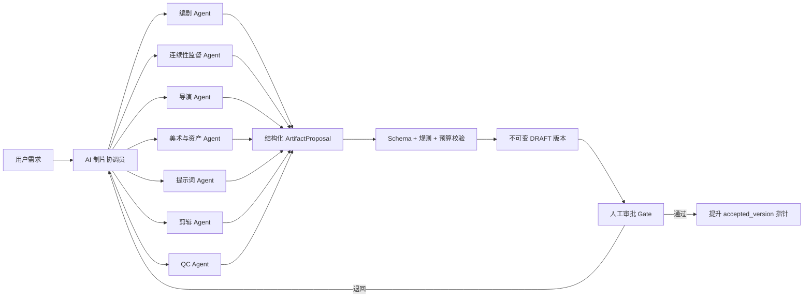

# 确定性工作流与 Agent 联合创作

V1 可实施合同见 [Agent/Skill Fake Runtime V1](../specs/agent-skill-runtime-v1.md)，界面合同见
[生产工作台 V1](../specs/studio-production-workspace-v1.md)，决策边界见
[ADR-0005](ADR-0005-agent-skill-proposal-boundary.md)。

## 基本分工

软件团队负责“机器必须遵守的规则”；电影团队 Agent 负责“在规则内提出创意”。模型输出永远是候选产物，不是数据库命令。



## 角色边界

| 角色             | 输入                                     | 输出                                    | 不允许做的事                                   |
| ---------------- | ---------------------------------------- | --------------------------------------- | ---------------------------------------------- |
| AI 制片协调员    | 用户目标、预算、平台、截止期、各部门状态 | 制作任务书、优先级、冲突清单、Gate 建议 | 写专业产物、审批、直接调用 Provider 或读取密钥 |
| 编剧 Agent       | 来源锚点、故事圣经、分集卡               | 场景剧本、台词、改编说明                | 删除来源关系或偷偷改变核心设定                 |
| 连续性监督 Agent | 全部已批准版本                           | 冲突报告、阻断或警告                    | 静默修改被监督产物                             |
| 导演 Agent       | 剧本、风格约束、时长                     | 导演阐述、节奏、表演、ShotIntent        | 绕过 VisualBible 或直接锁死供应商模型          |
| 美术与资产 Agent | 角色/场景/道具连续性、导演意图           | 视觉圣经、资产变体、一致性检查          | 覆盖已批准资产而不建新版本                     |
| 提示词 Agent     | ShotIntent、PromptPlan、能力快照         | 供应商无关提示计划与编译提案            | 修改权威 ShotIntent 或把外部文本升为系统指令   |
| 剪辑 Agent       | 已批准镜头、声音、字幕、节奏标记         | TimelineVersion 提案、修改单、导出计划  | 修改上游资产文件本体                           |
| QC Agent         | 候选素材、连续性、技术与权利规则         | PASS/FAIL、问题清单、发布建议           | 静默修复、自动批准或用免责声明代替授权证据     |

## 从小说到分镜

### 1. 原文摄取

- TXT/Markdown/DOCX/EPUB/PDF 进入标准化管线。
- 保留原文件 SHA-256、章节、段落、字符区间、页码（可用时）。
- 规范化文本不覆盖原文；每个 `SourceBlock` 同时记录原始和规范化哈希。
- OCR 或解析置信度低于阈值时进入人工校对 Gate。

### 2. 故事理解

按窗口抽取事件、人物、地点、道具、关系和时间点，再由全局归并器生成 Story Bible。模型必须给出证据 `SourceSpan[]`；没有证据的新创作标记为 `invented`，不能伪装成原著事实。

### 3. 改编规划

建立 `AdaptationLedger`：每个原文事件标记为保留、合并、移动、扩写、删除或新增，并附理由。生成季弧、集弧和分集卡后由制片/编剧 Gate 确认，再生成场景剧本。

### 4. 剧本与镜头

场景剧本采用结构化 Scene/Beat/Dialogue/Action。导演 Agent 生成 ShotIntent：叙事目的、景别、机位、焦段语义、构图、主体动作、表情、场景状态、光线、镜头运动、时长、转场和声音意图。镜头可以反查所依据的台词、动作和原文。

### 5. 分镜和生成

美术/摄影 Agent 先选择已经批准的角色、服装、场景、道具版本，再生成参考拼图和分镜帧。需要动态镜头时，视频生成器以首尾帧、镜头意图和动作约束为输入。生成结果先进入候选池，人工选中后才成为批准资产。

## 影视制作不是单向瀑布

导演、分镜、剪辑和声音必须在昂贵生成前共同验证节奏。标准片场流为：

```text
剧本可行性检查
  -> 桌读 / 临时对白 scratch voice
  -> 镜头表 + coverage plan
  -> 带临时声轨的 animatic
  -> 1–2 秒运动技术样片 motion proof
  -> 关键帧与资产锁定
  -> 正式生成
  -> 粗剪
  -> 补拍/重生成清单
  -> 精剪与 picture lock
  -> online/color/VFX
  -> dialogue/sound/music mix
  -> subtitle/legal
  -> final master QC
```

每个镜头的 coverage 用途必须标记为 master、establishing、over-shoulder、insert、reaction、transition 或 audio-bridge。计划为动态的镜头还必须描述人物运动、环境运动、摄影机运动、起止状态、动作节拍、前后剪辑手柄和可安全切出的区间；降级成静帧/2.5D 需显式标记，不能冒充“全动态”。

## 提示词生成器

提示词不直接保存在一个大文本框里，而分成三层：

1. `ShotIntent`：供应商无关的创作意图，是权威数据。
2. `PromptPlan`：把意图扩展为主体、动作、环境、摄影、风格、连续性引用、负面条件和音频指令。
3. `CompiledPrompt`：针对某个供应商/模型的最终文本、图片引用、参数与能力降级报告。

编译示例：

```json
{
  "shot_id": "shot_014",
  "provider": "xai",
  "model": "configured-video-model",
  "positive": "...",
  "negative": "...",
  "references": [{ "asset_version_id": "char_lin_v7", "role": "character" }],
  "parameters": { "duration_s": 5, "aspect_ratio": "9:16" },
  "losses": ["provider_does_not_support_camera_path"]
}
```

用户可编辑任意层，但修改 `CompiledPrompt` 只影响这一次尝试；修改 ShotIntent 会让所有供应商编译结果失效并可重新生成。每次调用记录模型、参数、种子（可用时）、成本、延迟、输入输出哈希和服务商任务 ID。

## 工作流节点契约

每个节点定义：

```yaml
node_type: screenplay.generate
contract_version: 1
inputs:
  episode_plan: artifact://episode-plan/v3
  story_bible: artifact://story-bible/v8
outputs:
  screenplay: schema://screenplay/v1
execution:
  mode: agent
  idempotency_scope: project+node+input_hash
  max_attempts: 2
  timeout_seconds: 900
gate:
  required: true
  roles: [producer, writer]
invalidation:
  downstream: [shot_plan, voice_plan, timeline]
```

状态按层分离：NodeRun 保存 `BLOCKED/PENDING/RUNNING/RECONCILIATION_REQUIRED/NEEDS_REVIEW/SUCCEEDED/FAILED/CANCEL_REQUESTED/CANCELLED/SUPERSEDED`；单次 Attempt 保存 `READY/LEASED/RUNNING/SUBMIT_INTENT/SUBMITTING/WAITING_REMOTE/REMOTE_UNKNOWN/SUCCEEDED/FAILED/CANCEL_REQUESTED/CANCELLED/NOT_SUBMITTED`。队列只负责唤醒执行；数据库状态机决定什么可以运行。存在 `REMOTE_UNKNOWN` Attempt 时不得创建下一 Attempt。

## 生产 Gate

| Gate                | 审批内容                                                     | 通过后冻结                      | 下游关键影响        |
| ------------------- | ------------------------------------------------------------ | ------------------------------- | ------------------- |
| G0 需求立项         | 目标平台、受众、题材、时长、预算、权利                       | ProductionBrief/DeliveryProfile | 全部                |
| G1 原文解析         | 章节、规范化和来源锚点                                       | SourceDocumentVersion           | 圣经/改编           |
| G2 故事圣经         | 人物、关系、世界观、时间线                                   | StoryBible/Canon                | 分集/剧本/资产      |
| G3 分集规划         | 钩子、冲突、时长、改编账本                                   | EpisodePlan                     | 剧本/镜头           |
| G4 剧本             | 场景、台词、节奏、来源与新增                                 | Screenplay                      | 声音/镜头/时间线    |
| G4T 桌读            | 临时对白能否自然说完、发音和节奏                             | ScratchVoice/ReadthroughReport  | 镜头时长/字幕       |
| G5 视觉圣经         | 角色/服装/场景/道具版本和 9:16 安全区                        | VisualBible/AssetVersion        | 分镜/生成           |
| G6A 镜头与 Coverage | ShotIntent、剪辑手柄、覆盖用途、预算                         | ShotPlan/CoveragePlan           | Animatic/生成       |
| G6B 生产就绪        | Animatic、MotionProof、供应商能力损失、资产齐套              | Animatic/MotionProofReport      | 正式生成            |
| G7A 粗剪与补拍      | RoughCut、连续性、缺口和补拍优先级                           | RoughCut/PickupList             | 重生成/精剪         |
| G7B 画面锁定        | FineCut、最终帧边界、转场和画面连续性                        | PictureLock                     | 声音/字幕/口型/母版 |
| G7C Finishing       | OnlineMaster、MixMaster、SubtitleMaster、CueSheet、权利      | MasterCandidate                 | Master QC           |
| G8 母版发布         | Technical/Continuity/Editorial/Creative/Rights QC 与平台规格 | ReleaseManifest/MasterQCReport  | 正式导出            |

解冻已批准产物必须说明原因，系统计算失效下游并由负责人确认费用和工期。

每个 Gate 都记录输入版本、最终人类审批人、检查表、未解决意见、决定和豁免。决定为 `approved/rejected/approved_with_waiver`；AI 只能建议，不能成为法律或创意责任主体。权利缺失、媒体损坏、缺少必需声轨/字幕、严重安全问题和 DeliveryProfile 不合规不可豁免；只有明确的创意偏差可由指定责任人豁免。单用户模式允许同一人兼任岗位，但 UI 必须明确显示“自审”，团队模板可要求双人审批。锁定事实不是永久不可改：通过 Canon Change Request 记录旧值、新值、生效集、原因、批准人和影响集合。

RoughCut、FineCut、PictureLock、OnlineMaster、MixMaster、SubtitleMaster 和 ReleaseManifest 是不同 ArtifactVersion。PictureLock 后任何画面帧变化都自动使对白/口型、MixMaster、SubtitleMaster 和 MasterQCReport stale；不能以“只替换一个 Clip”为理由绕过。

连续性不是一条自然语言备注。场景和镜头保存机读 `ContinuityStateBefore/After`，至少覆盖人物外观、服装/伤势、道具与左右手、屏幕方向/目线、位置、时间/天气/光线、动作接点、声线和发音。无法自动证明安全的改动扩大为待人确认的影响范围，不静默复用旧素材。

## 正式节点和交接产物

| 节点                  | DRI            | 主要输入                       | 主要输出                             | 失败/拒收原因                    |
| --------------------- | -------------- | ------------------------------ | ------------------------------------ | -------------------------------- |
| `source.ingest`       | 编辑/系统      | 原文件                         | SourceManifest/SourceBlock           | 格式、编码、来源映射不可靠       |
| `story.extract`       | 编剧           | SourceSpan                     | StoryBibleProposal/CanonConflict     | 无证据、别名冲突、时间线冲突     |
| `adaptation.plan`     | 制片/编剧      | StoryBible                     | AdaptationLedger/EpisodePlan         | 时长、钩子、原著损失不可接受     |
| `screenplay.generate` | 编剧           | EpisodePlan/Canon              | Screenplay                           | 来源缺失、台词/场景不可执行      |
| `readthrough.build`   | 声音/剪辑      | Screenplay/VoicePlan           | ScratchVoice/ReadthroughReport       | 台词超时、发音/停顿问题          |
| `visual_bible.build`  | 美术           | Canon/DirectorTreatment        | VisualBible/AssetVersion             | 身份、服装、权利或竖屏构图问题   |
| `shot.plan`           | 导演/摄影/剪辑 | Screenplay/VisualBible         | ShotPlan/CoveragePlan                | 无覆盖、手柄不足、预算不可行     |
| `animatic.build`      | 剪辑/声音      | ShotPlan/ScratchVoice          | Animatic                             | 时长、节奏、钩子或对白不成立     |
| `motion.prove`        | 生成师/导演    | 高风险 Shot/ProviderCapability | MotionProofReport                    | 身份漂移、动作/方向/控制不支持   |
| `asset.generate`      | 生成师         | PromptPlan/批准引用            | GenerationAttempt/AssetVersion       | 安全拒绝、成本、质量或连续性失败 |
| `roughcut.build`      | 剪辑           | 批准资产/Voice/Sound           | RoughCut/PickupList                  | 叙事缺口、不可剪、连续性硬错     |
| `picture.lock`        | 导演/剪辑      | FineCut                        | PictureLock                          | 补拍未结、帧边界或转场未定       |
| `sound.finish`        | 声音           | PictureLock/VoicePlan          | SoundSpottingPlan/CueSheet/MixMaster | ADR、授权、响度、同步问题        |
| `online.finish`       | 在线/字幕      | PictureLock                    | OnlineMaster/SubtitleMaster          | 媒体缺失、字幕区、画质问题       |
| `master.qc`           | 制片/法务/QC   | 全部 Master/RightsLedger       | MasterQCReport/ReleaseManifest       | 任一不可豁免阻断项               |

每个节点的具体 Schema、权限、失效边和 CI fixture 在实施 Issue 中版本化；消费者必须显式接受、拒收或请求修订，不允许静默补字段。

## 成本与失败控制

- 生成前显示预计调用数、费用区间和最长等待时间。
- 工作区/项目/日设置硬预算和软告警；超过硬预算不自动调用。
- 输入哈希、本地幂等键和供应商任务 ID 用于去重；供应商不支持幂等/查询且响应丢失时进入 `REMOTE_UNKNOWN`，绝不自动重提，由人对账。
- 批量任务支持暂停；取消语义区分“未发出”“已发出不可取消”“供应商已取消”。
- 失败可重新编译到另一供应商，但保留原尝试和质量评分，禁止静默替换。
- 提交前按最坏情况原子预留 `reserved` 预算，完成后记录 `accrued` 并与供应商 `billed` 对账；并发任务不能只看历史花费。
- 失败 fallback 分为“可发布”和“仅供审片”。仅供审片的静帧或低质插值不能通过 G8。
